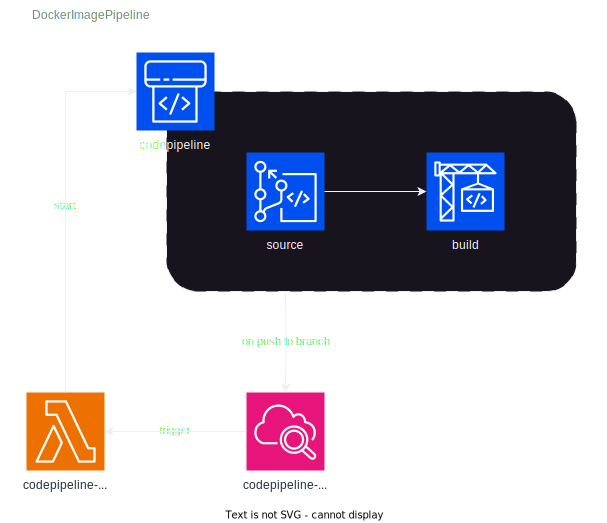

# Codepipeline for Docker Images

This CDK project creates codepipelines to build and push docker images to ECR. A Lambda function controls when a codepipeline is triggered so that is possible to have better control of when pipelines must start.




## Requirements

```bash
node		>= 18.18.0
npm			>= 9.8.1
cdk 		>= 2.102.0
aws-cli    	>= 2.11.15
```

## Useful commands

* `npm run build`   compile typescript to js
* `npm run watch`   watch for changes and compile
* `cdk deploy`      deploy this stack to your default AWS account/region
* `cdk diff`        compare deployed stack with current state
* `cdk synth`       emits the synthesized CloudFormation template


## Deploy

With the following instructions you will be able to setup a codepipeline to build and deploy docker images when commits are pushed to a codecommit repository.

- Create a codecommit repository
- Push the content of the `./sample-repository` folder to this codecommit repository
- Copy the codecommit repository ARN and its name
- Open `./lib/docker-image-pipeline-stack.ts` and change the `dockerImagePipelines` variable to:

obs: remember to change `REPOSITORY_NAME` and `REPOSITORY_ARN` with the values you copied before

````js
const dockerImagePipelines = [
      {
        codecommitRepository: codecommit.Repository.fromRepositoryArn(
          this,
          "REPOSITORY_NAME", 
          "REPOSITORY_ARN"
        ),
        branches: [
          'main',
          'develop'
        ]
      },
    ]
````
- Open `./bin/cdk-docker-image-pipeline.ts` and set `env` with your account id and region. 
- run `npm install`
- run `cdk deploy`

After that you should have configured a codepipeline for your codecommit repository. It will trigger whenever a commit is pushed to `main` or `develop` branches.